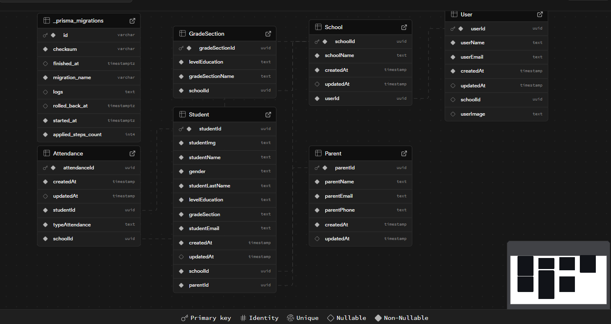

<p align="center">
    
</p>

<h2 align="center">Backend Repository</h2>

> Developed by [Sebastian Urdanegui](https://github.com/SebastianUrdaneguiBisalaya), [Leslie Zarate](https://github.com/LeslieZT), [Alexandra Rios](https://github.com/alexamibco) and [Ana Rivas](https://github.com/Cabrakana).


<p align="center">
    <a href="https://exploryq.vercel.app" align="center">
        
    </a>
    <a href="https://www.figma.com/design/fXW7IPhMuYhg3kaVGTTiwD/App-To-Find-Events?node-id=0-1&m=dev&t=SPPGu7PemDSKcoaJ-1">
        
    </a>
    <a href="https://alexamibco.atlassian.net/jira/software/projects/EVENT/boards/67/timeline?shared=&atlOrigin=eyJpIjoiYzM0NDc1YWU0Y2Q1NGJkMzkzZWJhYjM4NDdjNWFlNzUiLCJwIjoiaiJ9">
        
    </a>
    <a href="https://github.com/SebastianUrdaneguiBisalaya/App-To-Find-Events">
        
    </a>
</p>

<div>
    <h2>Documentation</h2>
</div>

### Table of Contents
- [Table of Contents](#table-of-contents)
- [About](#about)
- [Database](#database)
- [Endpoints](#endpoints)
  - [Auth](#auth)
    - [Sign Up (POST)](#sign-up-post)
    - [Verify Account (GET)](#verify-account-get)
    - [Login (POST)](#login-post)
    - [Log Out (POST)](#log-out-post)
  - [Events](#events)
    - [Get Trending Events (GET)](#get-trending-events-get)
    - [Get This Week Events (GET)](#get-this-week-events-get)
    - [Get Upcoming Events (GET)](#get-upcoming-events-get)
    - [Get Input Search Trending Events (GET)](#get-input-search-trending-events-get)
    - [Get Input Search This Week Events (GET)](#get-input-search-this-week-events-get)
    - [Get Input Search Upcoming Events (GET)](#get-input-search-upcoming-events-get)
    - [Get Event Detail By Id (GET)](#get-event-detail-by-id-get)
    - [Get User History Events By User Id (GET)](#get-user-history-events-by-user-id-get)
    - [Get User Favorite Events By User Id (GET)](#get-user-favorite-events-by-user-id-get)
    - [Toggle Event To Favorite (POST)](#toggle-event-to-favorite-post)
  - [Payments](#payments)
    - [Checkout (POST)](#checkout-post)
    - [Success (GET)](#success-get)
    - [Cancel (GET)](#cancel-get)
  - [Users](#users)
    - [Get User By Id (GET)](#get-user-by-id-get)
    - [Update User By Id (PUT)](#update-user-by-id-put)
    - [Delete User By Id (DELETE)](#delete-user-by-id-delete)
  - [Upload Images](#upload-images)
      - [Upload Image (POST)](#upload-image-post)

### About

### Database



### Endpoints

#### Auth

##### Sign Up (POST)
```curl
https://app-to-find-events-backend.onrender.com/auth/sign-up
```

##### Verify Account (GET)

```curl
https://app-to-find-events-backend.onrender.com/auth/verify/:token
```

##### Login (POST)

```curl
https://app-to-find-events-backend.onrender.com/auth/login
```

##### Log Out (POST)

```curl
https://app-to-find-events-backend.onrender.com/auth/logout
```

#### Events

##### Get Trending Events (GET)

```curl
https://app-to-find-events-backend.onrender.com/trendingevents
```

##### Get This Week Events (GET)

```curl
https://app-to-find-events-backend.onrender.com/thisweekevents
```

##### Get Upcoming Events (GET)

```curl
https://app-to-find-events-backend.onrender.com/upcomingevents
```

##### Get Input Search Trending Events (GET)

```curl
https://app-to-find-events-backend.onrender.com/istrendingevents
```

##### Get Input Search This Week Events (GET)

```curl
https://app-to-find-events-backend.onrender.com/isthisweekevents
```

##### Get Input Search Upcoming Events (GET)

```curl
https://app-to-find-events-backend.onrender.com//isupcomingevents
```

##### Get Event Detail By Id (GET)

```curl
https://app-to-find-events-backend.onrender.com/eventdetail/:event_id
```

##### Get User History Events By User Id (GET)

```curl
https://app-to-find-events-backend.onrender.com/userhistoryevents/:user_id
```

##### Get User Favorite Events By User Id (GET)

```curl
https://app-to-find-events-backend.onrender.com/myfavoritevents/:user_id
```

##### Toggle Event To Favorite (POST)

```curl
https://app-to-find-events-backend.onrender.com/toggle-favorite-events
```

#### Payments

##### Checkout (POST)

```curl
https://app-to-find-events-backend.onrender.com/payments/checkout
```

##### Success (GET)

```curl
https://app-to-find-events-backend.onrender.com/payments/success
```

##### Cancel (GET)

```curl
https://app-to-find-events-backend.onrender.com/payments/cancel
```

#### Users

##### Get User By Id (GET)
```curl
https://app-to-find-events-backend.onrender.com/users/:id
```

##### Update User By Id (PUT)

```curl
https://app-to-find-events-backend.onrender.com/users/:id
```

##### Delete User By Id (DELETE)

```curl
https://app-to-find-events-backend.onrender.com/users/:id
```

#### Upload Images

###### Upload Image (POST)

```curl
https://app-to-find-events-backend.onrender.com/upload
```
